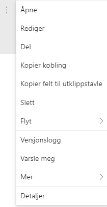

# Oppbygning av løsningen

## Informasjonsarkitektur

     

Figur 1: Struktur i Prosjektportalen 365.

1)  På toppen finner du *porteføljenivået* som befinner seg på
    toppnivået (illustrert i gult) som Prosjektportalen 365 er
    installert i. Dette er en hub i SharePoint.

2)  Under toppnivået (med egne SharePoint-områder) ligger alle
    *prosjektområdene* (illustrert med rosa). Hvert prosjektområde
    inneholder et enkelt prosjekt.

3)  Hvert prosjektområde er utstyrt med en verktøykasse som består både
    av ren funksjonalitet (fasevelger, prosjektinfo med mere) samt
    lister og biblioteker (prosjektlogg, usikkerheter, dokumentbibliotek
    med mere), illustrert med grått.

4)  Innholdet i form av dokumenter, loggelementer, usikkerhetselementer
    og så videre ligger lagret i den enkelte liste eller bibliotek,
    illustrert med blått.

Informasjonsarkitekturen viser også den hierarkiske strukturen for
Prosjektportalen 365:

> Portefølje (Hub) \> Prosjektområde (SharePoint-område) \> Lister \>
> Innhold

## Tilgangsstyring og innsyn i prosjekter

Alt innhold i Prosjektportalen 365 er tilgangsstyrt. Dette betyr at du
må tildeles rettigheter i portefølje og prosjekter før du kan bruke
dem. Selv om du har tilgang på porteføljenivå

vil du ikke nødvendigvis ha tilgang til enkeltprosjekter.

Tilgangsstyring settes opp for hvert enkelt prosjekt. Alle nye
prosjekter vil automatisk få sine egne tilgangsgrupper ved opprettelse.
Rettighetene er basert på standardtilganger i Office 365 med følgende
tre nivåer:

<table>
<thead>
<tr class="header">
<th>Tilgangsnivå</th>
<th>Rettigheter</th>
</tr>
</thead>
<tbody>
<tr class="odd">
<td>Eier</td>
<td>Eiere har administratortilgang til et område. Det gir dem full kontroll over området med alle rettigheter det innebærer.</td>
</tr>
<tr class="even">
<td>Medlemmer</td>
<td>Medlemmer har bidragsytertilgang til et område. Det gir dem tilgang til å redigere, slette og opprette nye filer, lister og sider i området det gjelder.</td>
</tr>
<tr class="odd">
<td>Gjest</td>
<td>
Gjester er eksterne brukere. Som gjest får man samme rettigheter som medlemmer beskrevet over.

Det er opp til din organisasjon å bestemme om prosjekter skal kunne deles eksternt med gjester eller ikke.
</td>
</tr>
</tbody>
</table>

Rettigheter kan også begrenses til å kun gjelde SharePoint-området til
prosjektet, eller videre nedover til kun å gjelde spesifikt innhold i
prosjektet slik som dokumentbibliotek, lister eller enkeltfiler. Dette
kan du lese mer om i Microsoft sine egne sider om rettigheter på
SharePoint-områder.\[1\]

Selv om brukere har en tilgang som medlem, kan fortsatt deler av
prosjektrommet avgrenses og kreve høyere tilgang.

## Navigasjonsmenyer og områdeikon

De tre viktigste metodene for å navigere Prosjektportalen 365, er:

1.  **Områdeikonet:** Trykk på områdeikonet for å komme tilbake til
    forsiden på området du er i (enten på portefølje eller prosjektnivå)

2.  **Venstrenavigasjon:** Brukes i prosjektområdene til å navigere i
    verktøy og lister i området du er i. I prosjektområder vil det si at
    du beveger deg mellom innhold innenfor det aktuelle prosjektet.
    Hjem-lenken tar deg alltid til forsiden for prosjektet.

3.  **Toppnavigasjon:** Denne tar deg til forsiden i Prosjektportalen
    365 eller direkte til ulike funksjoner i porteføljeområdet.

*Områdeikonet* og *venstrenavigasjonen* er tilpasset til det området du
befinner deg i. Toppnavigasjonen er lik uansett hvilket område i
Prosjektportalen 365 du befinner deg i og lenker tilbake til
porteføljenivå.

## Standardinnhold og endring av standardinnhold i Prosjektportalen

Standarddokumenter, standardinteressenter, standardoppgaver og standard
fasesjekkpunkter vedlikeholdes på porteføljenivå, og kan enkelt endres
av en administrator eller bruker med riktig tilgang. Når
Prosjektportalen installeres, fylles flere av disse listene med
standardinnhold fra Prosjektveiviseren.

Innhold fra listene og biblioteket vil kunne kopieres inn i alle nye
prosjekter som blir opprettet i denne porteføljen (dette er valg som kan
gjøres ved opprettelse av et nytt prosjekt).

Innhold vedlikeholdes i *Konfigurasjon av Prosjektportalen* som du
finner under avsnittet for ‘*Utseende og funksjonalitet’* i
områdeinnstillinger. I bildet under er de fire standardlistene markert.
Trykk på den du ønsker å endre innhold i for å legge til, fjerne eller
endre elementer.

## Arbeide med lister og biblioteker i SharePoint

De fleste av prosjektverktøyene består av SharePoint-lister som er
tilpasset ulike formål. I listene er det en del fellesnevnere som er
verdt å lære seg for å gjøre det enklere å arbeide med dem.

I Prosjektportalen omfatter disse *Prosjektlogg, Interessentregister,
Kommunikasjonsplan, Usikkerhet, Dokumenter, Fasesjekkliste,
Endringsanalyse, Gevinstanalyse og gevinstrealiseringsplan,
Måleindikatorer, Gevinstoppfølging, Prosjektleveranser og
Ressursallokering.*

Merk at hvert element har egne felter (kolonner), avhengig av
informasjonen som er relevant for den lista. Redigering; legge til,
slette eller endre oppføring i listene er lik for alle. Det vil si at
når du har lært deg å redigere en liste kan du benytte deg av samme
metode for de andre listene.

Menyene tilpasser seg det du gjør, så ved å markere en oppføring i en
liste får du andre menyvalg enn hvis den ikke er markert.

### Listemenyen, når du ikke har valgt et element

1)  ***Ny*** lar deg legge til et nytt element i lista.

2)  ***Eksporter til Excel*** eksporterer listen til en Excel-fil som
    lastes ned på PC-en din.

3)  ***Hurtigredigering*** lar deg gjøre raske endringer i lista i
    tabellform.

4)  *PowerApps* lar deg opprette og behandle PowerApps.

5)  *Med Flyt* kan du enkelt opprette en ny Flyt relatert til listen
    du stå i. Man kan også lett komme seg til en oversikt over sine
    Flyter for å kunne jobbe videre med disse.

6)  *Ellipsemenyen*  gir deg flere valg, for eksempel
    ***Varsle meg*** om du ønsker varsler på endringer i lista.

7)  ***Alle elementer*** og ***Filterikonet*** lar deg se de ulike
    visningene som er tilgjengelige for lista. Du kan også lage egne
    visninger om ønskelig.

8)  *I**nformasjonsikonet***  viser de siste endringene som
    har skjedd i lista.

### Listemenyen, når et element er valgt

I bildet under har vi markert et element i prosjektloggen. Da endrer
menyen seg til å gjelde endringer i oppføringen som du har valgt:

1)  *Rediger* lar deg redigere valgt element.

2)  ***Del*** lar deg dele valgt element med en eller flere brukere (med
    eller uten tilgang til selve prosjektet)

3)  Trykk på ***Kopier kobling*** for å lage en kobling til valgt
    element som gir tilgang til alle som får koblingen tilsendt. Etter
    koblingen er opprettet kan den enkelt fjernes (sammen med delingen)
    fra samme sted.

4)  Trykk på *Slett* for å slette det valgte elementet.

5)  Med *Flyt* kan du kjøre flyter som allerede er knyttet til listen,
    eller du kan opprette helt egne Flyter

6)  Ellipsemenyen  gir deg flere menyvalg, bl.a.
    versjonsloggen som gir deg tilgang til alle versjoner og historikk
    tilhørende valgt element. Du kan også sette opp varsel på
    enkeltelementer ved å trykke på ***Varsle meg*** etter at et element
    er valgt som i bildet over.

7)  ***Alle elementer*** og ***Filterikonet*** lar deg se de ulike
    visningene som er tilgjengelige for lista. Du kan også lage egne
    visninger om ønskelig.

8)  *I**nformasjonsikonet***  viser de siste endringene som har
    skjedd i lista.

### Bruk ellipsemenyen når du arbeider med elementer i en liste

Når du har valgt et element i en liste kan du høyre-klikke på elementets
tittel eller trykke på ellipsemenyen  for å velge hva du vil gjøre med
elementet.

Hvilke handlinger som kan velges i ellipsemenyen bestemmes av hva slags
element du har valgt. Derfor vil tilgjengelige valg være avhengig av hva
slags liste, og hva slags element, du jobber med.
|                               |                                                           |                          |
| ----------------------------- | --------------------------------------------------------- | ------------------------ |
| Åpne                          | Elementet åpnes i sidemenyen (lesemodus)                  |  |
| Rediger                       | Elementet åpnes i sidemenyen (redigeringsmodus)           |                          |
| Del                           | Del det merkede elementer med andre personer              |                          |
| Kopier kobling                | Få en kobling for å dele adressen til elementet           |                          |
| Kopier felt til utklippstavle | Hvis du skal kopiere inn innholdet i feltet et annet sted |                          |
| Slett                         | Slett det valgte elementet                                |                          |
| Flyt                          | Aksjoner knyttet til Flyt på det aktuelle elementet       |                          |
| Versjonslogg                  | Viser versjonsloggen for elementet                        |                          |
| Varsle meg                    | Sett opp varsel på elementet                              |                          |
| Mer                           | Øvrige handlinger som er mulige for dette elementet       |                          |
| Detaljer                      | Åpner egenskapsfeltet for elementet i sidemenyen          |                          |

### Bruk ellipsemenyen når du arbeider med dokumenter i et bibliotek

Når du har valgt et dokument i et bibliotek kan du høyreklikke på
dokumentets tittel, eller trykke på ellipsemenyen
 for å velge hva du vil gjøre med
dokumentet.

|                          |                                                                     |                          |
| ------------------------ | ------------------------------------------------------------------- | ------------------------ |
| **Åpne**                 | Dokumentet åpnes i sidemenyen (lesemodus)                           |  |
| **Forhåndsvis**          | Viser hvordan dokumentet ser ut                                     |                          
| **Del**                  | Del det merkede dokumentet med andre personer                       |                          
| **Kopier kobling**       | Få en kobling som andre kan bruke for å få tilgang til dokumentet   |                          
| **Lagre til senere**     | Du kan markere dokumentet for gjenfinning                           |                          
| **Last ned**             | Last ned en kopi av dokumentet til din lokale maskin                |                          
| **Slett**                | Slett det valgte dokumentet                                         |                          
| **Flyt**                 | Aksjoner knyttet til Flyt på det aktuelle elementet                 |                          
| **Gi nytt navn**         | Endre navnet på dokumentet                                          |                          
| **Fest til toppen**      | Dokumentet markeres for visning som flis over biblioteket           |                          
| **Flytt til**            | Du kan flytte dokumentet til en annen plassering                    |                          
| **Kopier til**           | En kopi av dokumentet kan opprettes på en annen plassering          |                          
| **Versjonslogg**         | Viser versjonsloggen for dokumentet                                 |                          
| **Varsle meg**           | Sett opp varsel på dette dokumentet                                 |                          
| **Mer**                  | Øvrige handlinger som er mulige for dette dokumentet                |                          
| **Last ned som** **PDF** | Dokumentet lastes ned til lokal maskin og blir lagret i .pdf format |                          
| **Lagre som** **PDF**    | En kopi av dokumentet i .pdf-format blir lagret i biblioteket       |                          
| **Detaljer**             | Åpner egenskapsfeltet for dokumentet i sidemenyen                   |                          

##  Slik endrer du områdeikon på portefølje- og prosjektområde

Områdeikonet for porteføljenivået og prosjektområdet kan endres av
områdets eier/ områdeadministrator. Fremgangsmåten er lik både for
portefølje- og prosjektnivå, derfor gjelder informasjonen under for
begge.

Ikonet endres enkelt ved hjelp av disse stegene:

1)  Trykk på tannhjulet øverst i høyre hjørne og velg
    *Nettstedsinformasjon*:
    
     

2)  Velg *Endre* under *Logo for område* for å sette inn eller endre
    logo som skal vises på området

3)  Under *Områdenavn* angir du det navnet som skal vises på området.

4)  *Områdebeskrivelse* er en mer utfyllende tekst for området.

5)  *Personverninnstillinger,* her angir du hvilken tilgangsstyring som
    skal gjelde for området. Hvis dette er på porteføljenivå, vil
    innstillingen du velger ikke gjelde
    for prosjektene som blir opprettet under porteføljen. Prosjektene
    vil ha selvstendig kontroll på dette.

6)  Trykk *Lagre* for å lagre endringene.

1.  https://support.microsoft.com/nb-no/office/deling-og-tillatelser-ac85fbf1-2431-49bf-8690-f1a2b98af65f?ui=nb-NO\&rs=nb-NO\&ad=NO
