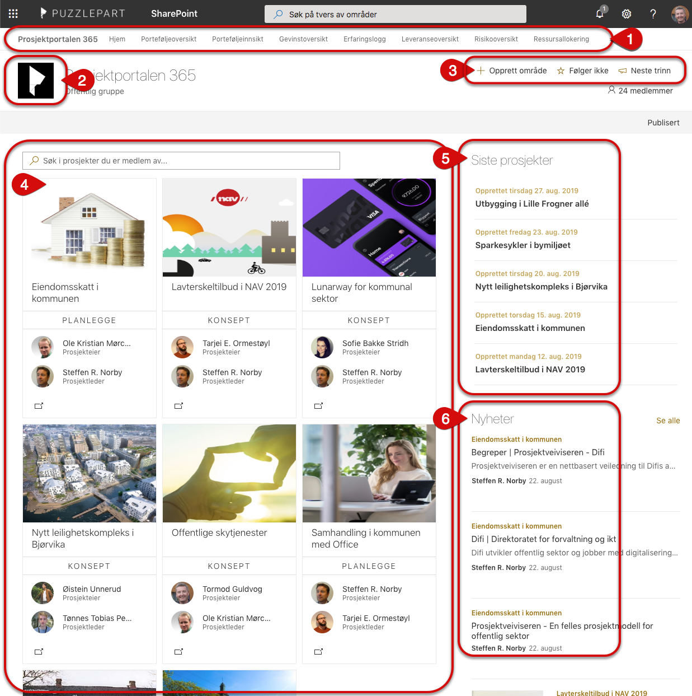

# Forside

På forsiden får du en oversikt over tilgjengelige prosjekter med nøkkelinfo om hvert prosjekt. Her kan du også opprette nye prosjekter. 

1.	Toppnavigasjon: Denne tar deg til forsiden i Prosjektportalen 365 eller direkte til ulike funksjoner i porteføljeområdet. 
2.	Ikon for denne installasjonen av Prosjektportalen. Dette kan tilpasses av administrator.
3.	Opprett nytt prosjekt ved å trykke på «Opprett nytt prosjekt». Tilgangen til å opprette nye prosjekter styres på porteføljenivå. 
4.	Prosjektoversikt med søk på alle prosjekter i porteføljen (a) og prosjektkort (b) som lenker til prosjektet og viser prosjektets fase, prosjektleder og prosjekteier. 
     a.	Trykk på nederst til venstre i hvert prosjektkort for å se ytterligere prosjektinformasjon. 
5.	Siste prosjekter gir oversikt over de siste prosjektene som er blitt opprettet i Prosjektportalen. Du ser bare prosjekter som du har tilgang til.
6.	Nyheter viser artikler som er publisert på prosjektområdene.

I tillegg er det et område for lenker nederst på siden. Lenker kan brukes til å peke til nyttige områder eller dokumenter som er relevante for brukere av Prosjektportalen. Lenkene vises for alle brukere som har tilgang til porteføljenivået.

